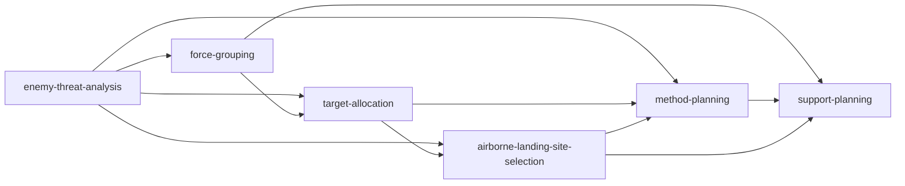

# 智能任务规划模块总览文档

## 1. 文档范围与代码依据

本文档面向“智能任务规划模块”的真实算法升级、接口适配与测试验证。当前仓库中的规划算法已经不是纯空函数占位：6 个算法均在 Node 运行时中提供了内置启发式实现，但 README 仍明确说明这些算法“尚未接入真实高精度地形代价场、外部仿真引擎或标定过的保障数据库”。因此本文把现有实现视为“平台标准结果与启发式占位实现”，后续真实算法必须保持字段兼容。

核心源码与入口：

| 类型 | 文件 / 入口 | 说明 |
|---|---|---|
| 模块运行时 | `apps/server/src/planning-runtime.js` | 算法定义、任务模板、输入归一化、内置执行器、上下游上下文、导出包 |
| 后端导出入口 | `apps/server/src/planning.js` | 透传 `evaluatePlanning / getPlanningTemplate / validatePlanning` |
| HTTP 接口 | `apps/server/src/index.js` | `/api/planning/template`、`/api/planning/validate`、`/api/planning/evaluate`、任务实例与执行记录接口 |
| 前端状态模块 | `apps/web/src/modules/planningWorkflow.js` | 模板加载、算法输入、绑定、任务实例、执行、结果包下载 |
| 算法配置页 | `apps/web/src/views/planning/PlanningAlgorithmsStep.vue` | 内置方法、资源库、本地文件、算法选项表单 |
| 流程编排页 | `apps/web/src/views/planning/PlanningTaskFlowStep.vue` | 步骤与算法实现绑定 |
| 执行总览页 | `apps/web/src/views/planning/PlanningTaskExecutionOverview.vue` | 执行、归档、导出、分算法入口 |
| 单算法结果页 | `apps/web/src/views/planning/PlanningTaskExecutionResultStep.vue` | `structuredOutput` 展示、表格、三维结果、JSON 明细 |
| 现有测试 | `apps/server/src/planning-runtime.support.test.js`、`apps/server/src/index.contract.test.js` | 保障规划、缺上游、显式输入、任务附件拆分等契约 |

## 2. 模块目录位置

智能任务规划模块没有独立的 `apps/planning` 目录，采用“后端运行时 + 前端 workflow + 规划页面”的结构：

- 后端算法模块：`apps/server/src/planning-runtime.js`
- 后端 HTTP 聚合：`apps/server/src/index.js`
- 前端规划 workflow：`apps/web/src/modules/planningWorkflow.js`
- 前端规划页面：`apps/web/src/views/planning/`
- 三维规划结果组件：`apps/web/src/components/PlanningThreatMapPanel.vue`

## 3. 整体架构

```mermaid
flowchart TD
  A[前端 PlanningAlgorithmsStep] --> B[planningWorkflow.algorithmInputs]
  C[前端 PlanningTaskFlowStep] --> D[planningWorkflow.algorithmBindings]
  E[任务实例 /api/tasks] --> F[服务端 tasks + task_attachments]
  B --> F
  D --> F
  G[执行按钮] --> H[/api/planning/validate]
  H --> I[validatePlanning]
  I --> J[loadPlanningDataset]
  I --> K[normalizeAlgorithmInputs]
  H --> L[/api/planning/evaluate]
  L --> M[evaluatePlanning]
  M --> N[executeTaskPlanning]
  N --> O[BUILTIN_EXECUTORS 或外部网关]
  O --> P[execution.steps[].structuredOutput]
  P --> Q[buildFinalResult.consolidatedOutputs]
  Q --> R[outputPackages: json/html/geojson/csv]
  R --> S[结果页与下载]
```

执行过程中，`executeTaskPlanning()` 按任务步骤顺序执行，每完成一个步骤，就把该步骤的 `structuredOutput` 同时写入：

- `context.stageOutputs[step.id]`
- `context.stageOutputs[algorithm.id]`

这就是后续算法读取上游结果的统一方式。

## 4. 6 个算法功能对比表

| 序号 | 算法名称 | 算法 id | 内置方法 key | 输入模式 | 主要上游 | 主要输出 |
|---:|---|---|---|---|---|---|
| 1 | 敌情威胁自动分析 | `enemy-threat-analysis` | `knowledge-fusion`、`coverage-priority` | `resource-library`、`local-file` | 无 | `threatScore`、`enemyIntentions`、`fireCoverage`、`airDefenseSystem`、`visualization` |
| 2 | 作战力量智能编组 | `force-grouping` | `rule-inference`、`genetic-optimization`、`hybrid-balanced` | `resource-library`、`local-file` | `enemy-threat-analysis` | `schemes`、`comparison`、`preferredScheme`、`constraintSummary` |
| 3 | 作战目标自动分配 | `target-allocation` | `hungarian`、`ant-colony`、`multi-objective` | `upstream-result` | `enemy-threat-analysis`、`force-grouping` | `candidateTargets`、`platforms`、`comparedPlans`、`preferredPlan`、`validation` |
| 4 | 机降地域优化选择 | `airborne-landing-site-selection` | `weighted-score`、`pareto-ranking`、`constraint-screening` | `upstream-result` | `enemy-threat-analysis`、`target-allocation` | `rankedCandidates`、`preferredCandidate`、`methodComparison`、`visualization` |
| 5 | 作战方法自动规划 | `method-planning` | `a-star`、`dijkstra`、`rrt` | `upstream-result` | `enemy-threat-analysis`、`target-allocation`，机降任务还消费选址结果 | `comparedPlans`、`preferredPlan.routes`、`phases`、`keyActions`、`visualization` |
| 6 | 作战保障自动规划 | `support-planning` | `demand-driven`、`balanced-scheduling`、`loss-aware` | `upstream-result` + 结构化手填 | `force-grouping`、`method-planning`，机降任务还需要 `airborne-landing-site-selection` | `requirements`、`allocations`、`airspaceWindows`、`matchingAnalysis`、`resourcePool` |

## 5. 统一输入模型

前端传给后端的核心执行负载有两种形态：

```json
{
  "taskCenterId": 123,
  "assessmentName": "火力打击任务规划任务"
}
```

或直接传入完整规划定义：

```json
{
  "taskId": "fire-strike-task",
  "assessmentName": "火力打击任务规划任务",
  "taskDefinition": {},
  "bindings": {
    "step-threat-analysis": "enemy-threat-analysis:builtin"
  },
  "algorithmInputs": {
    "enemy-threat-analysis": {
      "builtinMethodKey": "knowledge-fusion",
      "selectedSourceIds": [1, 2],
      "uploadedFiles": [],
      "options": {
        "analysisFocus": "comprehensive",
        "heatmapDensity": "medium",
        "impactBias": "balanced"
      }
    }
  }
}
```

统一算法输入结构：

| 字段 | 类型 | 必填 | 默认值 | 说明 |
|---|---|---:|---|---|
| `builtinMethodKey` | string | 是 | 来自 `algorithm.defaultConfig.builtinMethodKey` | 当前内置方法 key |
| `selectedSourceIds` | number[] | 否 | `[]` | 资源库数据源 id；空数组表示不使用资源库数据 |
| `uploadedFiles` | object[] | 否 | `[]` | 前端上传文件；任务保存时会拆到 `task_attachments`，详情/执行时回填 |
| `uploadedFiles[].id` | string | 是 | 前端生成 | 文件唯一 id |
| `uploadedFiles[].fileName` | string | 是 | 无 | 文件名 |
| `uploadedFiles[].fileExtension` | string | 是 | 从文件名推导 | `.doc/.docx/.pdf/.xls/.xlsx/.csv`；`.txt` 在算法定义中列出但当前 `normalizePlanningUpload()` 未解析，需确认 |
| `uploadedFiles[].size` | number | 否 | `0` | 文件大小 |
| `uploadedFiles[].fileContentBase64` | string | 是 | 无 | 文件内容 |
| `options` | object | 否 | 各算法默认配置 | 算法私有参数 |

数据集输入来自 `loadPlanningDataset(db)`：

| 字段 | 来源表 | 说明 |
|---|---|---|
| `sources` | `sources` | 数据源基础信息 |
| `previewsBySourceId` | `source_contents` | 资源预览内容，Map by `sourceId` |
| `intelligence` | `intelligence` | 红蓝情报记录 |
| `environment` | `environment` | 环境记录 |
| `extractions` | `extractions` | 文档/资源抽取条目，已含来源元信息 |

资源库筛选规则：`buildSourceBundle(dataset, selectedSourceIds)` 只返回被显式勾选的数据源、预览、抽取、环境；未勾选时不会使用全部资源库数据。

## 6. 统一输出模型

`evaluatePlanning()` 成功响应的顶层结构：

```json
{
  "assessmentName": "火力打击任务规划任务",
  "module": "intelligent-task-planning",
  "generatedAt": "ISO8601",
  "task": {
    "id": "fire-strike-task",
    "name": "火力打击任务",
    "category": "火力打击",
    "stepCount": 5,
    "finalDeliverableCount": 3
  },
  "execution": {
    "summary": {
      "completedSteps": 5,
      "builtinSteps": 5,
      "externalSteps": 0,
      "implementedSteps": 5,
      "placeholderSteps": 0
    },
    "steps": []
  },
  "result": {
    "title": "火力打击任务规划结果",
    "summary": "已完成 ...",
    "deliverables": [],
    "nextStepNotice": "...",
    "consolidatedOutputs": {
      "threatAnalysis": {},
      "forceGrouping": {},
      "targetAllocation": {},
      "airborneLandingSiteSelection": {},
      "methodPlanning": {},
      "supportPlanning": {}
    },
    "outputPackages": {}
  },
  "diagnostics": {
    "uploadedFileCount": 0,
    "selectedSourceCount": 0,
    "producedArtifactCount": 0,
    "placeholderSteps": 0,
    "sequenceIntegrity": 1
  }
}
```

单步骤标准包络：

| 字段 | 类型 | 说明 |
|---|---|---|
| `order` | number | 步骤序号 |
| `stepId` / `stepName` | string | 任务步骤 id 与名称 |
| `objective` / `consumes` / `produces` | string / string[] | 模板中的步骤说明 |
| `algorithm` | object | `{ id, name, category }` |
| `binding` | object | 算法实现 `{ id, name, type, runtimeKey, source, runtime, version, projectName, projectPath }` |
| `config` | object | 本次算法输入摘要，含 `builtinMethodKey / selectedSourceIds / uploadedFileCount / options` |
| `gateway` | object | 标准网关元数据，内置算法也会生成 |
| `status` | string | 当前固定为 `completed` |
| `summary` | string | 算法执行摘要 |
| `outputPreview` | string[] | 结果页预览文案 |
| `artifacts` | object[] | 产物清单 `{ name, description, status }` |
| `structuredOutput` | object | 各算法完整结构化结果 |

输出包：

| key | 格式 | 生成函数 | 内容 |
|---|---|---|---|
| `storageSnapshot` | json | `buildPlanningOutputPackages()` | 完整响应快照，前端可保存到本地快照 |
| `reportExport` | html | `buildPlanningReportHtml()` | 汇报 HTML |
| `spatialExport` | geojson | `buildPlanningSpatialExportData()` | 三维实体、环境覆盖、威胁场采样 |
| `comparisonExport` | csv | `buildPlanningComparisonCsv()` | 威胁、编组、分配、选址、战法、保障的方案对比行 |

## 7. 平台接口调用链路

1. 前端进入规划页：`initializePlanningWorkflow()` 并行调用 `api.getPlanningTemplate()`、资源接口和任务接口。
2. 创建任务实例：`createPlanningTaskInstance()` 调用 `POST /api/tasks`，保存 `planningTaskDefinition / planningBindings / planningAlgorithmInputs`。
3. 修改配置：前端 `setAlgorithmBuiltinMethod / toggleAlgorithmSource / updateAlgorithmOptions / addAlgorithmFiles` 更新 workflow 状态并延迟 `PUT /api/tasks/:id`。
4. 执行规划：`calculatePlanningAssessment()` 先保存任务，再调用 `POST /api/planning/validate`，最后调用 `POST /api/planning/evaluate`。
5. 服务端执行：`validatePlanning()` 校验任务、绑定、上游、输入；`evaluatePlanning()` 运行每个步骤并生成结果包。
6. 归档：使用任务实例执行时，`index.js` 创建 `task_runs`，成功后写 `task_results`。
7. 前端回放：`GET /api/tasks/:id/runs/:runId` 读取归档，`planningWorkflow.replayTaskRun()` 写回 `state.results`。

## 8. 算法注册与切换机制

注册点全部在 `apps/server/src/planning-runtime.js`：

- `ALGORITHM_DEFINITIONS`：声明算法 id、名称、分类、输入输出、内置方法、默认配置、文件类型、规则库/约束模型。
- `BUILTIN_EXECUTORS`：把算法 id 映射到内置执行函数。
- `buildRuntimeCatalog()`：构建 `builtin` 与外部工程运行时；当前 `PLANNING_EXTERNAL_ALGORITHM_PROJECTS = []`。
- `buildAlgorithmVariants()`：把运行时转换为前端可选实现，形成 `${algorithmId}:${runtimeKey}`。
- 任务模板 `buildFireStrikeTask()` 与 `buildAirAssaultTask()`：声明步骤顺序与默认绑定。

切换逻辑：

- 前端流程编排页修改 `state.algorithmBindings[step.id]`。
- 后端 `resolveBindingVariant(step, algorithm, task, bindings)` 按 `bindings -> task.defaultBindings -> algorithm.defaultVariantId -> variants[0]` 回退。
- 当前只有 6 个 `:builtin` 变体；外部工程恢复后要补 `PLANNING_EXTERNAL_ALGORITHM_PROJECTS`、参数 schema、默认参数和网关 URL 环境变量。

## 9. 上下游关系与共享模型



`REQUIRED_UPSTREAM_ALGORITHMS` 的硬校验：

| 算法 | 必须完成的上游 |
|---|---|
| `force-grouping` | `enemy-threat-analysis` |
| `target-allocation` | `enemy-threat-analysis`、`force-grouping` |
| `airborne-landing-site-selection` | `enemy-threat-analysis`、`target-allocation` |
| `method-planning` | `enemy-threat-analysis`、`target-allocation` |
| `support-planning` | `force-grouping`、`method-planning`；机降任务追加 `airborne-landing-site-selection` |

共享数据模型：

- 位置统一使用 `[longitude, latitude, altitude]`。
- 可视化实体统一使用 `{ id, name, type, camp, layerKey, color, geometryType, coordinates, radius, annotation, visible, meta }`。
- 环境覆盖统一使用 `{ id, kind, name, geometryType, geometry, weather, riskLevel, notes, sourceId, meta }`。
- 评分大多归一到 `0-100`，并通过 `round()` 保留 1 或 2 位小数。
- 结果解释统一由 `summary / outputPreview / artifacts / explanation / recommendations / matchingAnalysis` 等字段承担。

## 10. 通用评分体系

现有评分不是统一的单一公式，而是各算法围绕 `0-100` 的启发式评分：

| 算法 | 核心分数 | 主要因子 |
|---|---|---|
| 敌情威胁 | `threatScore` | 敌情数量、敌方强度、火力/防空/侦察/反机降压力、部署方向、证据条目 |
| 力量编组 | `scheme.score` | 火力、防护、侦察、保障、机动、均衡、角色适配、约束满足度 |
| 目标分配 | `plan.score` | 覆盖率、优先级覆盖、匹配度、可行性、射程利用率、负荷均衡、协同 |
| 机降选址 | `candidate.score` | 威胁暴露、安全、隐蔽、集结效率、直升机适配、距离约束 |
| 战法规划 | `plan.score` | 路线分数、生存性、协同、任务类型加成、峰值场代价惩罚 |
| 保障规划 | `plan.score` | 覆盖率、关键缺口、普通缺口、库存/运输/节点瓶颈、预备比例、战损压力 |

真实算法升级时建议保留：

- 所有对外分数字段继续 `0-100`。
- 所有推荐对象必须同时保留 `methodKey / methodLabel / score`。
- `systemBest*` 字段继续用于展示“用户选择方法”与“系统最高分方法”的差异。
- 解释文本必须说明主导因子，而不是只返回数字。

## 11. 通用测试策略

现有测试覆盖：

| 文件 | 测试点 |
|---|---|
| `planning-runtime.support.test.js` | 保障规划结构化战损输入、资源约束、缺编组上游、保障单步缺上游、敌情显式输入 |
| `index.contract.test.js` | 未知 `/api/*` 返回 JSON 404；任务列表不返回上传正文，任务详情回填附件 |

建议新增通用测试：

| 测试类别 | 输入 | 预期输出 | 验证点 |
|---|---|---|---|
| 模板契约 | `getPlanningTemplate()` | `summary.algorithmCount === 6`、`externalVariantCount === 0` | 注册表未丢字段 |
| 最小全链路 | 空 DB + 敌情/编组 CSV 上传 + 默认保障参数 | `execution.summary.completedSteps` 等于任务步骤数 | 每个 `structuredOutput.implementationStatus === "implemented"` |
| 空输入 | `enemy-threat-analysis` 无资源无文件 | 400 | `error.code=PLANNING_MISSING_DATA` |
| 缺上游 | 自定义只含 `support-planning` | 400 | `error.type=missing_upstream` |
| 极端值 | 保障资源池全 0 | 400 | `details.fieldGroup=resourcePool` |
| 前端兼容 | 单算法结果页读取每个输出 | 不报错 | `outputPreview/artifacts/visualization/tableSections` 可渲染 |
| 导出兼容 | 完整响应 | 4 类 `outputPackages` | JSON/HTML/GeoJSON/CSV 可下载 |

## 12. 开发优先级建议

1. 先补契约测试：把 6 个算法的 `structuredOutput` 必备字段写成断言，避免真实算法替换时破坏前端。
2. 修复输入解析不一致：`LOCAL_FILE_EXTENSIONS` 包含 `.txt`，但 `resolveImportedFileType()` 当前不解析 `.txt`，需确认是补 TXT 解析还是从前端/定义移除。
3. 补前端字段 alias：当前结果页部分旧字段名与实际输出不完全一致，例如选址页期望 `candidates/comparedPlans`，实际输出 `rankedCandidates/methodComparison`；目标分配页期望 `validationFindings`，实际输出 `validation`。
4. 抽离真实算法边界：把 6 个 `runBuiltin*` 中的“输入归一化、字段组装、算法核心”拆开，核心算法可单测。
5. 引入基准样例：为火力打击、机降突击各建立稳定 fixture，包含资源库数据、上传文件和期望 JSON schema。
6. 再替换核心模型：按算法风险从低到高推进，建议从敌情与编组的数据抽取/聚类开始，再做目标分配、路径规划、保障调度。

## 13. 从占位算法升级为真实算法的实施路线图

阶段一：冻结平台契约

- 为 `ALGORITHM_DEFINITIONS`、`BUILTIN_EXECUTORS`、`buildFinalResult()`、`outputPackages` 补 schema 测试。
- 把本文档中的字段表转成自动校验用例。
- 在前端结果页补实际字段 alias，确保新旧字段都能展示。

阶段二：拆分算法核心

- 敌情：拆 `extractEvidence -> buildThreatNodes -> scoreThreat -> buildVisualization`。
- 编组：拆 `buildForcePool -> buildRuleProfile -> solveGrouping -> evaluateConstraints`。
- 分配：拆 `buildTargets -> buildPlatforms -> solveAssignment -> validatePlan`。
- 选址：拆 `buildCandidates -> evaluateCandidate -> rankCandidates -> buildLandingVisualization`。
- 战法：拆 `buildRouteTasks -> buildCostField -> solveRoute -> evaluatePlan`。
- 保障：拆 `buildRequirements -> computeCapacity -> allocateResources -> analyzeGaps`。

阶段三：替换真实算法

- 内置路径可先替换核心函数，保持 `runBuiltin*` 的外层返回结构不变。
- 外部工程路径需在 `PLANNING_EXTERNAL_ALGORITHM_PROJECTS` 登记工程，并遵守 `algorithm-gateway-v1`。
- 外部返回建议仍用 `{ ok: true, result: { summary, outputPreview, artifacts, structuredOutput }, meta }`。

阶段四：验证与回归

- 运行 `npm test --workspace @mission/server`。
- 运行最小黑盒 `evaluatePlanning()` 火力打击与机降突击样例。
- 前端打开执行总览和 6 个单算法结果页，检查表格、三维实体、JSON、导出包。
- 校验任务列表不携带 base64，任务详情和执行接口可回填附件。

## 14. 开发任务清单

| 优先级 | 应修改文件 | 应实现 / 调整函数 | 应补测试 |
|---:|---|---|---|
| P0 | `apps/server/src/planning-runtime.js` | 为 6 个 `runBuiltin*` 输出增加字段契约守护，必要时补 `candidates / comparedPlans / validationFindings` 等兼容 alias | 新增规划 schema 测试：逐算法断言 `structuredOutput` 必备字段 |
| P0 | `apps/server/src/planning-runtime.js`、`apps/web/src/views/planning/PlanningAlgorithmsStep.vue` | 统一 `.txt` 支持口径：要么实现 `resolveImportedFileType()` 的 TXT 解析，要么从 `LOCAL_FILE_EXTENSIONS` 和前端 accept 文案移除 | 新增 `.txt` 上传成功或拒绝提示的契约测试 |
| P1 | `apps/web/src/views/planning/PlanningTaskExecutionResultStep.vue` | 结果页表格 specs 改为读取当前真实字段：`rankedCandidates / methodComparison / validation`，同时兼容旧字段 | 前端结果页轻量组件测试或 Playwright 冒烟 |
| P1 | `apps/server/src/planning-runtime.js` | 抽离 `collectThreatInputs / buildForcePool / buildCandidateTargets / buildRouteTasks / buildSupportRequirements` 等纯函数 | 对每个纯函数补单元测试和边界输入测试 |
| P1 | `apps/server/src/planning-runtime.js` | 重写敌情实体抽取、编组求解、目标分配、机降选址、路径代价场、保障调度核心逻辑 | 火力打击与机降突击两套固定 fixture 黑盒测试 |
| P2 | `apps/server/src/planning-runtime.js` | 扩展 `GROUPING_CONSTRAINT_MODELS` 和 `GROUPING_CONSTRAINT_EVALUATORS`，支持更多约束模型 | 约束模型注册与评分差异测试 |
| P2 | `apps/server/src/algorithm-gateway.js`、`apps/server/src/planning-runtime.js` | 若接入外部工程，补 `PLANNING_EXTERNAL_ALGORITHM_PROJECTS`、URL 环境变量、参数 schema、默认参数 | 外部网关成功/失败/超时 mock 测试 |
| P2 | `apps/web/src/components/PlanningThreatMapPanel.vue`、`apps/web/src/components/CesiumGlobe.vue` | 若真实敌情算法输出热力图，验证 `heatmapBase64 / heatmapGeojson / bounds` 三维叠加 | 浏览器截图与 GeoJSON 导出回归 |
